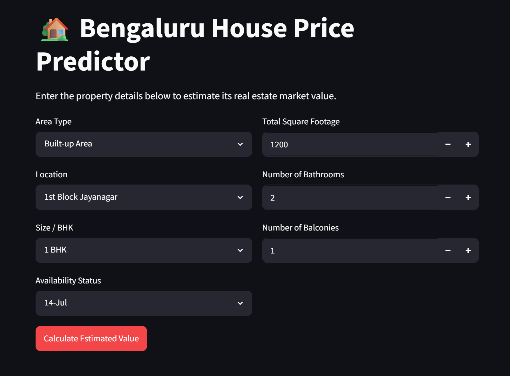

# 🏡 Bengaluru House Price Predictor

A containerized, full-stack machine learning application that predicts residential real estate prices in Bengaluru, India. This project transitions a standalone machine learning model into a production-ready microservice architecture using a decoupled frontend and backend.

---

## 🛠️ System Architecture

Instead of a monolithic script, the application is engineered as two isolated services that communicate securely across a virtual bridge network:

* **Backend API (FastAPI):** An ultra-fast asynchronous Python framework that loads the trained pipeline model artifact (`bengaluru_house_production_bundle.pkl`), exposes a structured REST API endpoint (`/predict`), processes incoming JSON payloads, and handles inference.
  
* **Frontend UI (Streamlit):** A responsive web interface allowing users to dynamically input property configurations and view predictions in real-time.

---

## 🚀 Key Features

* **Dynamic Data Inputs:** Select from over 100+ unique locations across Bengaluru via an intuitive user interface.
  
* **Decoupled Architecture:** Frontend and backend components are completely separated, matching industry deployment patterns.
  
* **Full Containerization:** Standardized configurations ensure the complete stack spins up identically on any machine with zero local dependency conflicts.
  
* **Optimized Image Builds:** Utilizes tailored slim base footprints (`python:3.11-slim`) to keep container weights minimal.

---

## 📦 Project Directory Structure

```text
├── data/                                 # Raw or processed dataset tracking files
├── venv/                                 # Local virtual environment (ignored by Git)
├── api.py                                # FastAPI backend application logic
├── app.py                                # Streamlit frontend interface UI
├── bengaluru_house_production_bundle.pkl # Trained ML pipeline model weights
├── Dockerfile.api                        # Blueprint for the backend API container
├── Dockerfile.app                        # Blueprint for the frontend web container
├── docker-compose.yml                    # Multi-container orchestration specification
├── requirements.txt                      # Global application dependencies
└── README.md                             # Project documentation

How to Run the Application Locally
Make sure you have Docker Desktop installed and running on your system.

Installation & Launch
Clone this repository to your local machine:

git clone [https://github.com/YOUR_USERNAME/bengaluru-house-price-predictor.git](https://github.com/YOUR_USERNAME/bengaluru-house-price-predictor.git)
cd bengaluru-house-price-predictor

Build and launch the microservice network with a single command:
docker compose up --build

Access the services in your browser:
Frontend Interface UI: http://localhost:8501
Backend API Interactive Docs: http://localhost:8000/docs

## Application Preview


